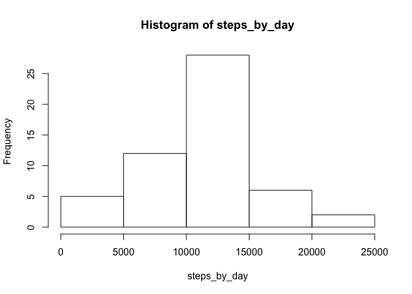
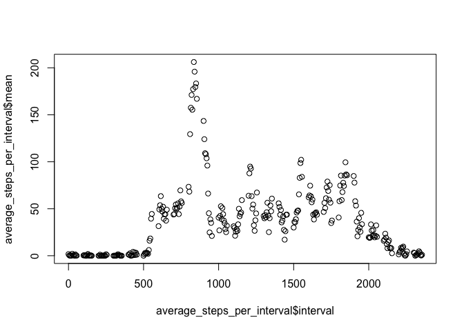
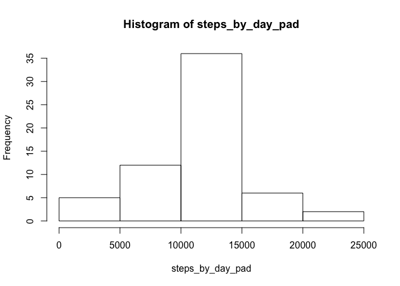
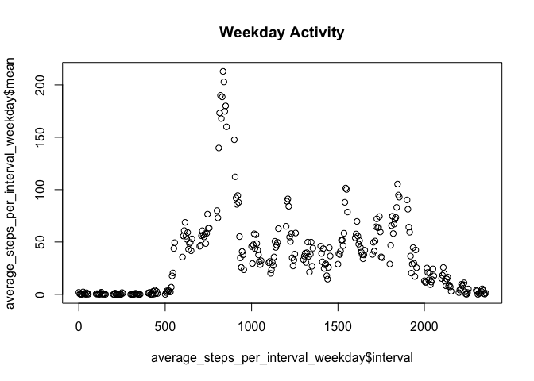
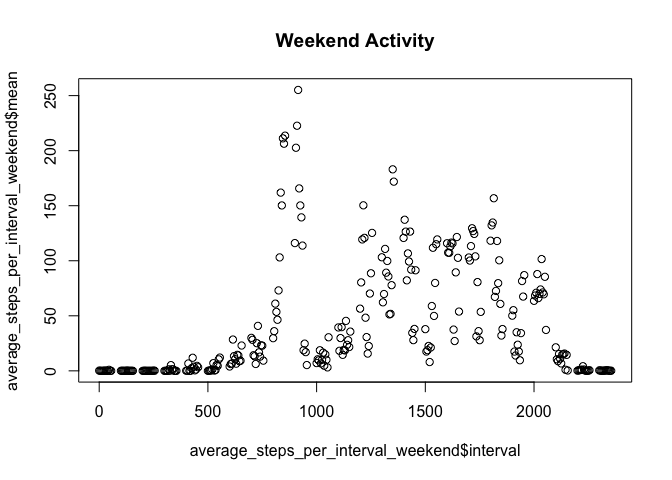

# Reproducible Research: Peer Assessment 1


## Loading and preprocessing the data

Unzip the provided activity.zip and load it.

```r
activity_data<-read.csv(unz("activity.zip","activity.csv"))
```

## What is mean total number of steps taken per day?
Sum steps for each day and calculate mean and median steps per day. Create a histogram with steps per day


```r
steps_by_day<-tapply(activity_data$steps,activity_data$date,FUN=sum)
mean_steps<-mean(steps_by_day,na.rm=TRUE)
median_steps<-median(steps_by_day,na.rm=TRUE)
hist(steps_by_day)
```

<!-- -->

So mean steps per day is 1.0766189\times 10^{4} and median steps per day is 10765

## What is the average daily activity pattern?
Calculate the average number of steps per interval, find the iterval with the maximum number of steps on averageand plot average daily avtivity.


```r
library("dplyr")
```

```
## 
## Attaching package: 'dplyr'
```

```
## The following objects are masked from 'package:stats':
## 
##     filter, lag
```

```
## The following objects are masked from 'package:base':
## 
##     intersect, setdiff, setequal, union
```

```r
steps_per_interval <- group_by(activity_data,interval)
average_steps_per_interval<-summarise(steps_per_interval,mean=(mean(steps,na.rm=TRUE)))
average_steps_per_interval[which.max(average_steps_per_interval$mean),]
```

```
## Source: local data frame [1 x 2]
## 
##   interval     mean
##      (int)    (dbl)
## 1      835 206.1698
```

```r
plot(average_steps_per_interval$interval,average_steps_per_interval$mean)
```

<!-- -->

## Imputing missing values

Number of missing intervals (Intervals with NA value): 2304

Since I already have the average steps per interval calculated one simple way to fill the data is to fill NA values with this.


```r
activity_data_pad<-activity_data
na_rows=is.na(activity_data_pad$steps)
avg_per_int<-tapply(activity_data$steps, activity_data$interval, mean, na.rm=TRUE, simplify=T)
activity_data_pad$steps[na_rows]<-avg_per_int[as.character(activity_data_pad$interval[na_rows])]
steps_by_day_pad<-tapply(activity_data_pad$steps,activity_data_pad$date,FUN=sum)
mean_steps_pad<-mean(steps_by_day_pad)
median_steps_pad<-median(steps_by_day_pad)
hist(steps_by_day_pad)
```

<!-- -->

So after padding the NA values mean steps per day is 1.0766189\times 10^{4} and median steps per day is 1.0766189\times 10^{4}
We see that the mean steps did not change, which is expected since we replaced NA with mean data but median had a small change and is now the same as the mean


## Are there differences in activity patterns between weekdays and weekends?

We split the data to two frames based on weekday/weekend and do do plots of the average steps per interval to compare the patterns


```r
activity_data_pad_weekend<-subset(activity_data_pad,weekdays(as.Date(date)) %in% c("Saturday",'Sunday"'))
activity_data_pad_weekdays<-subset(activity_data_pad,!weekdays(as.Date(date)) %in% c("Saturday",'Sunday"'))
steps_per_interval_weekend <- group_by(activity_data_pad_weekend,interval)
average_steps_per_interval_weekend<-summarise(steps_per_interval_weekend,mean=(mean(steps,na.rm=TRUE)))
steps_per_interval_weekday <- group_by(activity_data_pad_weekdays,interval)
average_steps_per_interval_weekday<-summarise(steps_per_interval_weekday,mean=(mean(steps,na.rm=TRUE)))
plot(average_steps_per_interval_weekday$interval,average_steps_per_interval_weekday$mean,main="Weekday Activity")
```

<!-- -->

```r
plot(average_steps_per_interval_weekend$interval,average_steps_per_interval_weekend$mean,main="Weekend Activity")
```

<!-- -->

It looks like there is significantly higher activity on weekends during the middle of the day, probably because people are not working...

